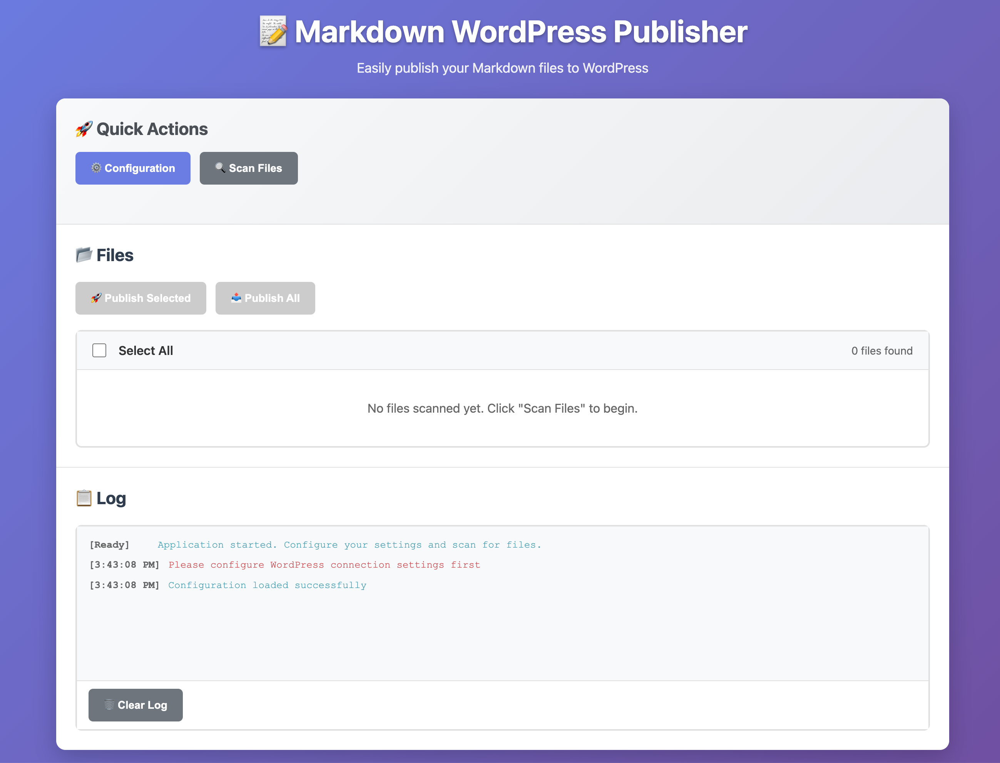

# Markdown WordPress Publisher (Wopress)

[English](./README_EN.md) | 中文

一个强大的Markdown文档批量发布工具，支持将本地Markdown文件一键发布到WordPress网站。提供桌面应用和Web版本两种使用方式。



## ✨ 项目特色

- 🚀 **批量发布**: 支持选择目录批量扫描和发布Markdown文件
- 📝 **智能解析**: 自动提取文章标题，将Markdown转换为HTML格式
- 🔄 **重复检测**: 智能避免重复发布，支持发布记录管理
- 🎯 **分类管理**: 自动创建或使用现有WordPress分类
- 👀 **实时预览**: 支持发布前预览Markdown渲染效果
- 📊 **进度跟踪**: 实时显示发布进度和详细日志
- 🌐 **双端支持**: 提供Electron桌面应用和纯Web版本
- ⚡ **轻量高效**: 无需复杂配置，开箱即用

## 🛠️ 技术栈

### 桌面版
- **Electron**: 跨平台桌面应用框架
- **Node.js**: 后端运行环境
- **HTML/CSS/JavaScript**: 前端界面开发
- **WordPress REST API**: 与WordPress网站通信

### Web版
- **纯前端实现**: 无需服务器部署
- **现代浏览器支持**: 支持所有主流浏览器
- **响应式设计**: 适配不同屏幕尺寸

## 📋 功能特性

### 核心功能
- ✅ Markdown文件批量扫描和发布
- ✅ WordPress应用密码认证
- ✅ 自动文章标题提取
- ✅ HTML格式转换
- ✅ 分类自动创建和管理
- ✅ 发布状态实时跟踪
- ✅ 重复发布检测
- ✅ 文章预览功能

### 界面特性
- ✅ 直观的文件管理界面
- ✅ 实时进度显示
- ✅ 详细操作日志
- ✅ 配置信息持久化
- ✅ 响应式布局设计

## 🚀 快速开始

### 桌面版安装

1. **克隆项目**
```bash
git clone https://github.com/fredww/wopress.git
cd wopress
```

2. **安装依赖**
```bash
npm install
```

3. **启动应用**
```bash
npm start
```

4. **打包应用**
```bash
npm run build
```

### Web版使用

1. **本地运行**
```bash
cd web-version
python3 -m http.server 8080
```

2. **访问应用**
打开浏览器访问 `http://localhost:8080`

## ⚙️ 配置说明

### WordPress设置

1. **启用REST API**: 确保WordPress网站已启用REST API
2. **创建应用密码**: 
   - 登录WordPress后台
   - 进入 用户 → 个人资料
   - 滚动到"应用密码"部分
   - 创建新的应用密码

### 应用配置

- **WordPress URL**: 你的WordPress网站地址（如：https://example.com/wp-json/wp/v2）
- **用户名**: WordPress用户名
- **应用密码**: 刚创建的应用密码
- **分类**: 文章发布的目标分类（可选）
- **扫描目录**: Markdown文件所在目录（桌面版）

## 📖 使用方法

### 桌面版操作流程

1. **配置连接**: 点击"配置"按钮，填写WordPress连接信息
2. **测试连接**: 点击"测试连接"确保配置正确
3. **扫描文件**: 点击"扫描文件"选择包含Markdown文件的目录
4. **选择文件**: 在文件列表中选择要发布的文件
5. **开始发布**: 点击"发布选中"或"发布全部"开始发布
6. **查看结果**: 在日志区域查看发布结果和文章链接

### Web版操作流程

1. **配置连接**: 点击"⚙️ 配置"按钮，在弹窗中填写WordPress信息
2. **选择文件**: 点击"📁 选择文件"上传本地Markdown文件
3. **发布文章**: 选择文件后点击"发布选中"或"发布全部"
4. **单篇发布**: 也可在"单篇文章"区域直接输入Markdown内容发布

## 📁 项目结构

```
wopress/
├── src/                    # 桌面版源码
│   ├── main.js            # Electron主进程
│   ├── preload.js         # 预加载脚本
│   ├── publisher.js       # 发布核心逻辑
│   └── renderer/          # 渲染进程
│       ├── index.html     # 主界面
│       ├── config.html    # 配置界面
│       ├── app.js         # 主应用逻辑
│       ├── config.js      # 配置逻辑
│       └── styles.css     # 样式文件
├── web-version/           # Web版本
│   └── index.html         # 单文件Web应用
├── assets/                # 资源文件
│   ├── icon.icns         # 应用图标
│   └── icon.svg          # SVG图标
├── test/                  # 测试文件
└── package.json           # 项目配置
```

## 🔧 开发指南

### 环境要求
- Node.js 16+
- npm 或 yarn
- 现代浏览器（Web版）

### 开发命令
```bash
# 开发模式
npm run dev

# 构建应用
npm run build

# 打包分发
npm run dist
```

### 贡献指南
1. Fork 本项目
2. 创建特性分支 (`git checkout -b feature/AmazingFeature`)
3. 提交更改 (`git commit -m 'Add some AmazingFeature'`)
4. 推送到分支 (`git push origin feature/AmazingFeature`)
5. 开启 Pull Request

## 🐛 常见问题

### Q: 连接WordPress失败怎么办？
A: 请检查：
- WordPress URL是否正确（需要包含 `/wp-json/wp/v2`）
- 用户名和应用密码是否正确
- WordPress网站是否启用了REST API
- 网络连接是否正常

### Q: 为什么文章发布后格式不对？
A: 本工具使用基础的Markdown解析，支持标题、粗体、斜体、代码等基本格式。复杂格式建议在WordPress后台进一步编辑。

### Q: 如何避免重复发布？
A: 应用会自动记录已发布的文件，重新扫描时会跳过已发布的内容。如需重新发布，请清除发布记录或重命名文件。

## 📄 许可证

本项目采用 MIT 许可证 - 查看 [LICENSE](LICENSE) 文件了解详情

## 🙏 致谢

感谢所有为这个项目做出贡献的开发者！

## 📞 联系方式

- 项目地址: [https://github.com/fredww/wopress](https://github.com/fredww/wopress)
- 问题反馈: [Issues](https://github.com/fredww/wopress/issues)

---

如果这个项目对你有帮助，请给个 ⭐️ Star 支持一下！

**一键三连支持开源** 🎉
- ⭐ Star 本项目
- 🍴 Fork 到你的仓库
- 📢 分享给更多朋友

让我们一起让内容创作更简单！