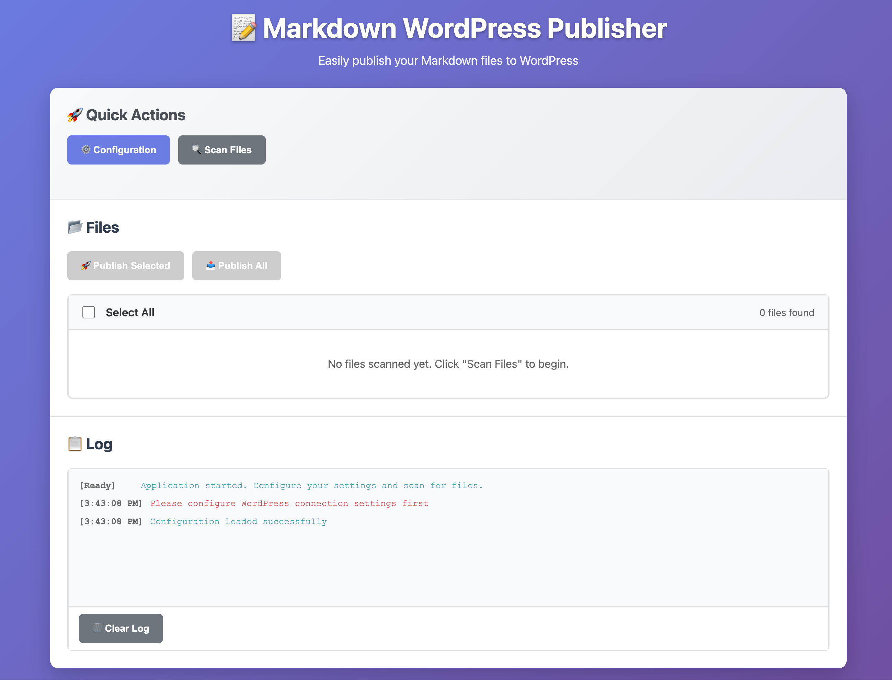

# Markdown WordPress Publisher (Wopress)

English | [中文](./README.md)

A powerful Markdown document batch publishing tool that supports one-click publishing of local Markdown files to WordPress websites. Available in both desktop application and web version.



## ✨ Project Features

- 🚀 **Batch Publishing**: Support directory scanning and batch publishing of Markdown files
- 📝 **Smart Parsing**: Automatically extract article titles and convert Markdown to HTML format
- 🔄 **Duplicate Detection**: Intelligently avoid duplicate publishing with publication record management
- 🎯 **Category Management**: Automatically create or use existing WordPress categories
- 👀 **Real-time Preview**: Support preview of Markdown rendering before publishing
- 📊 **Progress Tracking**: Real-time display of publishing progress and detailed logs
- 🌐 **Dual Platform Support**: Provides both Electron desktop app and pure web version
- ⚡ **Lightweight & Efficient**: No complex configuration required, ready to use out of the box

## 🛠️ Tech Stack

### Desktop Version
- **Electron**: Cross-platform desktop application framework
- **Node.js**: Backend runtime environment
- **HTML/CSS/JavaScript**: Frontend interface development
- **WordPress REST API**: Communication with WordPress websites

### Web Version
- **Pure Frontend Implementation**: No server deployment required
- **Modern Browser Support**: Supports all mainstream browsers
- **Responsive Design**: Adapts to different screen sizes

## 📋 Feature List

### Core Features
- ✅ Markdown file batch scanning and publishing
- ✅ WordPress application password authentication
- ✅ Automatic article title extraction
- ✅ HTML format conversion
- ✅ Category automatic creation and management
- ✅ Real-time publishing status tracking
- ✅ Duplicate publishing detection
- ✅ Article preview functionality

### Interface Features
- ✅ Intuitive file management interface
- ✅ Real-time progress display
- ✅ Detailed operation logs
- ✅ Configuration persistence
- ✅ Responsive layout design

## 🚀 Quick Start

### Desktop Version Installation

1. **Clone Project**
```bash
git clone https://github.com/fredww/wopress.git
cd wopress
```

2. **Install Dependencies**
```bash
npm install
```

3. **Start Application**
```bash
npm start
```

4. **Build Application**
```bash
npm run build
```

### Web Version Usage

1. **Local Run**
```bash
cd web-version
python3 -m http.server 8080
```

2. **Access Application**
Open browser and visit `http://localhost:8080`

## ⚙️ Configuration Guide

### WordPress Settings

1. **Enable REST API**: Ensure WordPress website has REST API enabled
2. **Create Application Password**: 
   - Login to WordPress admin
   - Go to Users → Profile
   - Scroll to "Application Passwords" section
   - Create new application password

### Application Configuration

- **WordPress URL**: Your WordPress website address (e.g., https://example.com/wp-json/wp/v2)
- **Username**: WordPress username
- **Application Password**: The application password just created
- **Category**: Target category for article publishing (optional)
- **Scan Directory**: Directory containing Markdown files (desktop version)

## 📖 Usage Instructions

### Desktop Version Workflow

1. **Configure Connection**: Click "Configure" button, fill in WordPress connection information
2. **Test Connection**: Click "Test Connection" to ensure configuration is correct
3. **Scan Files**: Click "Scan Files" to select directory containing Markdown files
4. **Select Files**: Choose files to publish from the file list
5. **Start Publishing**: Click "Publish Selected" or "Publish All" to start publishing
6. **View Results**: Check publishing results and article links in the log area

### Web Version Workflow

1. **Configure Connection**: Click "⚙️ Configure" button, fill in WordPress information in the popup
2. **Select Files**: Click "📁 Select Files" to upload local Markdown files
3. **Publish Articles**: After selecting files, click "Publish Selected" or "Publish All"
4. **Single Article Publishing**: You can also directly input Markdown content in the "Single Article" area for publishing

## 📁 Project Structure

```
wopress/
├── src/                    # Desktop version source code
│   ├── main.js            # Electron main process
│   ├── preload.js         # Preload script
│   ├── publisher.js       # Publishing core logic
│   └── renderer/          # Renderer process
│       ├── index.html     # Main interface
│       ├── config.html    # Configuration interface
│       ├── app.js         # Main application logic
│       ├── config.js      # Configuration logic
│       └── styles.css     # Style files
├── web-version/           # Web version
│   └── index.html         # Single-file web application
├── assets/                # Resource files
│   ├── icon.icns         # Application icon
│   └── icon.svg          # SVG icon
├── test/                  # Test files
└── package.json           # Project configuration
```

## 🔧 Development Guide

### Environment Requirements
- Node.js 16+
- npm or yarn
- Modern browser (Web version)

### Development Commands
```bash
# Development mode
npm run dev

# Build application
npm run build

# Package for distribution
npm run dist
```

### Contribution Guide
1. Fork this project
2. Create feature branch (`git checkout -b feature/AmazingFeature`)
3. Commit changes (`git commit -m 'Add some AmazingFeature'`)
4. Push to branch (`git push origin feature/AmazingFeature`)
5. Open Pull Request

## 🐛 FAQ

### Q: What to do if WordPress connection fails?
A: Please check:
- Whether WordPress URL is correct (should include `/wp-json/wp/v2`)
- Whether username and application password are correct
- Whether WordPress website has REST API enabled
- Whether network connection is normal

### Q: Why is the article format incorrect after publishing?
A: This tool uses basic Markdown parsing, supporting basic formats like headings, bold, italic, code, etc. For complex formats, further editing in WordPress admin is recommended.

### Q: How to avoid duplicate publishing?
A: The application automatically records published files and skips published content when rescanning. To republish, clear publication records or rename files.

## 📄 License

This project is licensed under the MIT License - see [LICENSE](LICENSE) file for details

## 🙏 Acknowledgments

Thanks to all developers who contributed to this project!

## 📞 Contact

- Project Repository: [https://github.com/fredww/wopress](https://github.com/fredww/wopress)
- Issue Reports: [Issues](https://github.com/fredww/wopress/issues)

---

If this project helps you, please give it a ⭐️ Star!

**Triple Support for Open Source** 🎉
- ⭐ Star this project
- 🍴 Fork to your repository
- 📢 Share with more friends

Let's make content creation easier together!